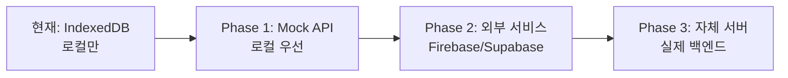

# 하이브리드 저장소 구현 가이드 (현실적 접근)

## 📋 프로젝트 개요

**목표**: 퍼블리시 후 서버 업로드를 지원하는 하이브리드 저장소 시스템 구현
**현재 환경**: Next.js 정적 사이트 (Static Export), 백엔드 서버 없음
**전략**: 점진적 마이그레이션 (로컬 → 외부 API → 자체 서버)
**기간**: 단계별 구현 (Phase 1-4)
**협업**: AI 에이전트 A, B 역할 분담

### 🎯 현재 상황 고려사항
- **정적 사이트**: Next.js API Routes 사용 불가
- **배포 환경**: Netlify/Vercel 등 정적 호스팅
- **백엔드**: 현재 없음, 향후 외부 서비스 또는 자체 서버 구축
- **마이그레이션**: 기존 IndexedDB 데이터 유지하면서 점진적 전환

---

## 🚀 수정된 구현 전략

### **현실적인 접근 방법**



### **환경별 모드 전환**

```typescript
// src/config/storage.ts
export const STORAGE_CONFIG = {
  // 개발 환경
  development: {
    mode: 'local-only',
    apiUrl: null,
    syncEnabled: false
  },
  
  // 외부 API 서비스 연동 시
  external: {
    mode: 'hybrid',
    apiUrl: process.env.NEXT_PUBLIC_API_URL,
    syncEnabled: true,
    service: process.env.NEXT_PUBLIC_API_SERVICE // 'firebase' | 'supabase' | 'aws'
  },
  
  // 자체 서버 구축 시
  selfHosted: {
    mode: 'hybrid',
    apiUrl: process.env.NEXT_PUBLIC_API_URL,
    syncEnabled: true,
    service: 'custom'
  }
};
```

---

## 🤖 AI 에이전트 역할 분담 (수정)

### **Agent A: 외부 서비스/API 담당**
- **담당 영역**: 외부 API 서비스 연동, 파일 저장소, 인증
- **주요 작업**:
  - Firebase/Supabase/AWS 연동
  - API 클라이언트 구현
  - 파일 업로드/다운로드 로직
  - 인증 시스템 (OAuth, JWT)
  - 환경 설정 관리

### **Agent B: 프론트엔드/클라이언트 담당**
- **담당 영역**: 클라이언트 로직, UI/UX, 동기화 관리
- **주요 작업**:
  - 타입 정의 및 인터페이스
  - HybridStorage 클래스 구현
  - UI 컴포넌트 수정
  - 동기화 상태 관리
  - 오프라인 지원

---

## 📁 파일 구조 및 작업 분배 (수정)

```
src/
├── config/
│   └── storage.ts            # Agent A: 환경별 설정
├── types/
│   ├── furniture.ts          # Agent B: 타입 확장
│   ├── api.ts               # Agent A: API 타입 정의
│   └── storage.ts           # Agent B: 저장소 타입
├── services/
│   ├── storage/
│   │   ├── localStorage.ts   # Agent B: 로컬 저장소
│   │   ├── hybridStorage.ts  # Agent B: 하이브리드 저장소
│   │   └── syncManager.ts    # Agent B: 동기화 관리
│   ├── api/
│   │   ├── firebase.ts       # Agent A: Firebase 연동
│   │   ├── supabase.ts       # Agent A: Supabase 연동
│   │   └── aws.ts           # Agent A: AWS 연동
│   └── auth/
│       └── authService.ts    # Agent A: 인증 서비스
├── utils/
│   ├── customLibrary.ts     # Agent B: 기존 코드 수정
│   └── fileOptimizer.ts     # Agent A: 파일 최적화
└── components/
    └── features/
        └── furniture/
            └── EnhancedFurnitureCatalog.tsx  # Agent B: UI 수정
```

---

## 🎯 Phase 1: 로컬 우선 + Mock API (현재 환경)

### **Agent B 작업 (프론트엔드)**

#### 1.1 타입 정의 확장
**파일**: `src/types/furniture.ts`
```typescript
// 추가할 타입들
export type StorageMode = 'local-only' | 'hybrid';
export type SyncStatus = 'pending' | 'synced' | 'conflict' | 'error' | 'disabled';

export interface CustomFurnitureItem extends FurnitureItem {
  storage: {
    mode: StorageMode;
    localId: string;
    serverId?: string;
    version: number;
  };
  sync: {
    status: SyncStatus;
    lastSynced?: number;
    serverVersion?: number;
    conflictData?: any;
  };
  files: {
    model: {
      local: Blob;
      server?: string;
      size: number;
      hash: string;
    };
    thumbnail: {
      local: Blob;
      server?: string;
      size: number;
      hash: string;
    };
  };
  metadata: {
    createdAt: number;
    updatedAt: number;
    createdBy: string;
    tags: string[];
    isPublic: boolean;
  };
}
```

#### 1.2 HybridStorage 클래스 구현
**파일**: `src/services/storage/hybridStorage.ts`
```typescript
export class HybridStorage {
  private mode: StorageMode = 'local-only';
  private localStorage: LocalStorage;
  private syncManager: SyncManager;
  
  constructor() {
    this.mode = this.detectStorageMode();
    this.localStorage = new LocalStorage();
    this.syncManager = new SyncManager();
  }
  
  private detectStorageMode(): StorageMode {
    // 환경변수로 모드 결정
    return process.env.NEXT_PUBLIC_API_URL ? 'hybrid' : 'local-only';
  }
  
  // 가구 저장 (로컬 우선)
  async saveFurniture(item: CustomFurnitureItem): Promise<void> {
    // 1. 항상 로컬에 먼저 저장 (즉시 반응)
    await this.localStorage.save(item);
    
    // 2. 하이브리드 모드일 때만 서버 동기화
    if (this.mode === 'hybrid') {
      this.syncManager.queueSync(item); // 백그라운드
    }
  }
  
  // 가구 목록 조회
  async getFurnitureList(): Promise<CustomFurnitureItem[]> {
    const localItems = await this.localStorage.getAll();
    
    if (this.mode === 'hybrid') {
      // 서버와 동기화된 데이터 병합
      return this.syncManager.mergeWithServer(localItems);
    }
    
    return localItems;
  }
}
```

#### 1.3 기존 코드 수정
**파일**: `src/utils/customLibrary.ts`
```typescript
// 기존 saveCustomFurniture 함수를 HybridStorage 사용하도록 수정
export async function saveCustomFurniture(params: SaveParams): Promise<string> {
  const hybridStorage = new HybridStorage();
  
  // 기존 로직을 CustomFurnitureItem 형태로 변환
  const item: CustomFurnitureItem = {
    // ... 기존 로직
    storage: {
      mode: 'local-only', // 현재는 로컬만
      localId: makeId(),
      version: 1
    },
    sync: {
      status: 'disabled' // 현재는 동기화 비활성화
    }
  };
  
  await hybridStorage.saveFurniture(item);
  return item.storage.localId;
}
```

### **Agent A 작업 (외부 서비스)**

#### 1.4 환경 설정 관리
**파일**: `src/config/storage.ts`
```typescript
export interface StorageConfig {
  mode: StorageMode;
  apiUrl?: string;
  syncEnabled: boolean;
  service?: 'firebase' | 'supabase' | 'aws' | 'custom';
}

export const getStorageConfig = (): StorageConfig => {
  const apiUrl = process.env.NEXT_PUBLIC_API_URL;
  const service = process.env.NEXT_PUBLIC_API_SERVICE as any;
  
  if (!apiUrl) {
    return {
      mode: 'local-only',
      syncEnabled: false
    };
  }
  
  return {
    mode: 'hybrid',
    apiUrl,
    syncEnabled: true,
    service: service || 'custom'
  };
};
```

#### 1.5 Mock API 서비스 구현
**파일**: `src/services/api/mockApi.ts`
```typescript
export class MockApiService {
  // 실제 서버 없이 테스트용 Mock 구현
  async uploadFurniture(data: UploadFurnitureRequest): Promise<UploadFurnitureResponse> {
    // Mock 응답 반환
    return {
      id: data.name,
      serverId: `mock_${Date.now()}`,
      urls: {
        model: `mock://models/${data.name}.glb`,
        thumbnail: `mock://thumbnails/${data.name}.png`
      }
    };
  }
  
  async downloadFurniture(id: string): Promise<CustomFurnitureItem | null> {
    // Mock 데이터 반환
    return null;
  }
  
  async syncStatus(id: string): Promise<SyncStatus> {
    return 'synced';
  }
}
```

---

## 🎯 Phase 2: 외부 API 서비스 연동

### **Agent A 작업 (외부 서비스)**

#### 2.1 Firebase 연동
**파일**: `src/services/api/firebase.ts`
```typescript
import { initializeApp } from 'firebase/app';
import { getStorage, ref, uploadBytes, getDownloadURL } from 'firebase/storage';
import { getFirestore, doc, setDoc, getDoc } from 'firebase/firestore';

export class FirebaseApiService {
  private storage: any;
  private firestore: any;
  
  constructor() {
    const app = initializeApp(firebaseConfig);
    this.storage = getStorage(app);
    this.firestore = getFirestore(app);
  }
  
  async uploadFurniture(data: UploadFurnitureRequest): Promise<UploadFurnitureResponse> {
    // 1. 파일 업로드
    const modelRef = ref(this.storage, `furniture/${data.name}/model.glb`);
    const thumbnailRef = ref(this.storage, `furniture/${data.name}/thumbnail.png`);
    
    await uploadBytes(modelRef, data.files.model);
    if (data.files.thumbnail) {
      await uploadBytes(thumbnailRef, data.files.thumbnail);
    }
    
    // 2. URL 생성
    const modelUrl = await getDownloadURL(modelRef);
    const thumbnailUrl = data.files.thumbnail ? await getDownloadURL(thumbnailRef) : undefined;
    
    // 3. 메타데이터 저장
    const docRef = doc(this.firestore, 'furniture', data.name);
    await setDoc(docRef, {
      ...data,
      modelUrl,
      thumbnailUrl,
      createdAt: new Date(),
      updatedAt: new Date()
    });
    
    return {
      id: data.name,
      serverId: docRef.id,
      urls: { model: modelUrl, thumbnail: thumbnailUrl }
    };
  }
}
```

#### 2.2 Supabase 연동
**파일**: `src/services/api/supabase.ts`
```typescript
import { createClient } from '@supabase/supabase-js';

export class SupabaseApiService {
  private supabase: any;
  
  constructor() {
    this.supabase = createClient(
      process.env.NEXT_PUBLIC_SUPABASE_URL!,
      process.env.NEXT_PUBLIC_SUPABASE_ANON_KEY!
    );
  }
  
  async uploadFurniture(data: UploadFurnitureRequest): Promise<UploadFurnitureResponse> {
    // 1. 파일 업로드
    const { data: modelData } = await this.supabase.storage
      .from('furniture')
      .upload(`${data.name}/model.glb`, data.files.model);
    
    let thumbnailData = null;
    if (data.files.thumbnail) {
      const { data: thumbData } = await this.supabase.storage
        .from('furniture')
        .upload(`${data.name}/thumbnail.png`, data.files.thumbnail);
      thumbnailData = thumbData;
    }
    
    // 2. 메타데이터 저장
    const { data: furnitureData } = await this.supabase
      .from('furniture')
      .insert({
        name: data.name,
        category: data.category,
        metadata: data.metadata,
        model_path: modelData.path,
        thumbnail_path: thumbnailData?.path
      })
      .select()
      .single();
    
    return {
      id: data.name,
      serverId: furnitureData.id,
      urls: {
        model: this.getPublicUrl(modelData.path),
        thumbnail: thumbnailData ? this.getPublicUrl(thumbnailData.path) : undefined
      }
    };
  }
}
```

### **Agent B 작업 (프론트엔드)**

#### 2.3 동기화 관리자 구현
**파일**: `src/services/storage/syncManager.ts`
```typescript
export class SyncManager {
  private apiService: ApiService;
  private syncQueue: CustomFurnitureItem[] = [];
  
  constructor() {
    this.apiService = this.createApiService();
  }
  
  private createApiService(): ApiService {
    const service = process.env.NEXT_PUBLIC_API_SERVICE;
    
    switch (service) {
      case 'firebase':
        return new FirebaseApiService();
      case 'supabase':
        return new SupabaseApiService();
      case 'aws':
        return new AwsApiService();
      default:
        return new MockApiService();
    }
  }
  
  // 동기화 큐에 추가
  queueSync(item: CustomFurnitureItem): void {
    this.syncQueue.push(item);
    this.processQueue(); // 백그라운드 처리
  }
  
  // 큐 처리
  private async processQueue(): Promise<void> {
    while (this.syncQueue.length > 0) {
      const item = this.syncQueue.shift()!;
      try {
        await this.syncItem(item);
      } catch (error) {
        console.error('동기화 실패:', error);
        // 실패한 아이템을 큐 끝에 다시 추가
        this.syncQueue.push(item);
      }
    }
  }
  
  // 개별 아이템 동기화
  private async syncItem(item: CustomFurnitureItem): Promise<void> {
    if (item.sync.status === 'synced') return;
    
    try {
      const response = await this.apiService.uploadFurniture({
        name: item.name,
        category: item.category,
        metadata: item.metadata,
        files: {
          model: item.files.model.local,
          thumbnail: item.files.thumbnail.local
        }
      });
      
      // 서버 ID 업데이트
      item.storage.serverId = response.serverId;
      item.sync.status = 'synced';
      item.sync.lastSynced = Date.now();
      
      // 로컬 저장소 업데이트
      await this.localStorage.update(item);
      
    } catch (error) {
      item.sync.status = 'error';
      throw error;
    }
  }
}
```

#### 2.4 UI 컴포넌트 수정
**파일**: `src/components/features/furniture/EnhancedFurnitureCatalog.tsx`
```typescript
// 동기화 상태 표시 추가
const SyncStatusIndicator: React.FC<{ item: CustomFurnitureItem }> = ({ item }) => {
  const getStatusIcon = (status: SyncStatus) => {
    switch (status) {
      case 'synced': return '✅';
      case 'pending': return '⏳';
      case 'error': return '❌';
      case 'conflict': return '⚠️';
      case 'disabled': return '📱';
      default: return '❓';
    }
  };
  
  return (
    <span className="sync-status" title={`동기화 상태: ${item.sync.status}`}>
      {getStatusIcon(item.sync.status)}
    </span>
  );
};

// 가구 아이템에 동기화 상태 표시 추가
{item.sync && <SyncStatusIndicator item={item} />}
```

---

## 🎯 Phase 3: 자체 서버 구축 (선택사항)

### **Agent A 작업 (자체 서버)**

#### 3.1 Next.js API Routes 구현
**파일**: `src/pages/api/furniture/index.ts`
```typescript
// Next.js API Routes (정적 사이트에서는 사용 불가)
// 자체 서버 구축 시에만 사용

export default async function handler(req: NextApiRequest, res: NextApiResponse) {
  switch (req.method) {
    case 'POST':
      return handleUpload(req, res);
    case 'GET':
      return handleList(req, res);
    default:
      res.setHeader('Allow', ['GET', 'POST']);
      res.status(405).end(`Method ${req.method} Not Allowed`);
  }
}
```

#### 3.2 Express.js 서버 구현
**파일**: `server/index.js`
```javascript
// 별도 Express.js 서버 (선택사항)
const express = require('express');
const multer = require('multer');
const app = express();

app.post('/api/furniture', upload.single('model'), async (req, res) => {
  // 파일 업로드 처리
  // 데이터베이스 저장
  // 응답 반환
});
```

---

## 🔄 마이그레이션 전략

### **기존 데이터 보존**

```typescript
// src/services/migration/migrationService.ts
export class MigrationService {
  // 기존 IndexedDB 데이터를 새로운 형태로 변환
  async migrateFromIndexedDB(): Promise<void> {
    const oldItems = await this.getOldIndexedDBItems();
    
    for (const oldItem of oldItems) {
      const newItem: CustomFurnitureItem = {
        ...oldItem,
        storage: {
          mode: 'local-only',
          localId: oldItem.id,
          version: 1
        },
        sync: {
          status: 'disabled'
        }
      };
      
      await this.hybridStorage.saveFurniture(newItem);
    }
  }
}
```

### **점진적 전환**

```typescript
// 환경변수로 단계별 전환
// Phase 1: NEXT_PUBLIC_API_URL 없음 → 로컬만
// Phase 2: NEXT_PUBLIC_API_URL 설정 → 하이브리드
// Phase 3: NEXT_PUBLIC_API_SERVICE 설정 → 특정 서비스 연동
```

---

## 📋 체크리스트 (수정)

### **Phase 1 완료 기준**
- [ ] Agent B: 타입 정의 완료 (StorageMode, SyncStatus)
- [ ] Agent B: HybridStorage 클래스 구현
- [ ] Agent B: 기존 코드 수정 완료
- [ ] Agent A: 환경 설정 관리 구현
- [ ] Agent A: Mock API 서비스 구현
- [ ] 통합 테스트 통과 (로컬 모드)

### **Phase 2 완료 기준**
- [ ] Agent A: Firebase/Supabase 연동 구현
- [ ] Agent A: 인증 시스템 구현
- [ ] Agent B: 동기화 관리자 구현
- [ ] Agent B: UI 컴포넌트 수정
- [ ] 환경변수 설정으로 모드 전환 테스트
- [ ] E2E 테스트 통과 (하이브리드 모드)

---

## 🚨 주의사항 (수정)

### **현재 환경 고려사항**
- **정적 사이트**: Next.js API Routes 사용 불가
- **환경변수**: 클라이언트 사이드에서만 접근 가능
- **파일 크기**: 정적 호스팅 제한 고려
- **보안**: API 키는 공개되어도 되는 것만 사용

### **마이그레이션 주의사항**
- **기존 데이터**: IndexedDB 데이터 보존 필수
- **점진적 전환**: 사용자 경험 해치지 않도록
- **롤백 계획**: 문제 발생 시 이전 상태로 복구 가능

---

## 💡 권장사항

### **현재 단계 (Phase 1)**
1. **로컬 우선**: 기존 IndexedDB 방식 유지
2. **하이브리드 준비**: 타입과 구조만 미리 설계
3. **환경변수**: `NEXT_PUBLIC_API_URL` 없으면 로컬 모드

### **향후 단계 (Phase 2)**
1. **외부 서비스**: Firebase 또는 Supabase 추천
2. **점진적 전환**: 환경변수로 모드 전환
3. **사용자 선택**: 로컬/클라우드 저장 선택권 제공

이렇게 하면 현재 환경에서도 작업할 수 있고, 향후 서버 구축 시에도 쉽게 전환할 수 있습니다! 🚀
